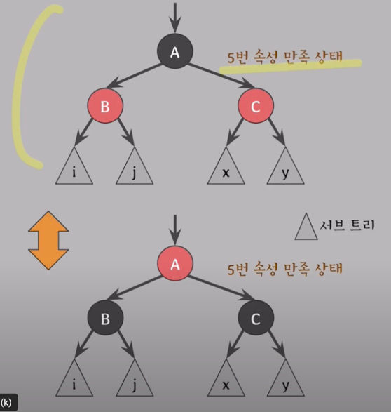

[쉬운 코드 - Red-Black Tree](https://www.youtube.com/watch?v=2MdsebfJOyM) 를 정리한 문서다.

# BST

BST(이진 탐색 트리)는 탐색, 삽입, 삭제 연산을 O(log n) 시간에 수행할 수 있지만, 삽입/삭제 연산을 수행할 때마다 트리의 높이가 증가할 수 있어 최악의 경우 O(n)
시간이 걸릴 수 있다.
이런 경우를 skewed tree(편향된 트리)라고 한다.

BST 의 탐색 속도를 항상 O(log n)으로 유지하기 위해 왼쪽 오른쪽 서브 트리의 높이의 균형을 맞추기 위해 고안된 트리(self-balancing binary search
tree) 중 `AVL Tree`와 `Red-Black Tree` 가 있다.

# Red-Black Tree

RB Tree 는 AVL Tree 보다 조금 더 많이 사용되는 self-balancing binary search tree 이다. 리눅스의 CPU 스케줄링, Java 의
hasMap, hashSet 등이 Red-Black Tree 로 구현되어 있다.

## Red-Black Tree 조건

다음의 조건을 만족하는 BST 를 Red-Black Tree 라고 한다.

- rule 1) 각 노드는 red 또는 black 이라는 색깔을 가진다.
- rule 2) Root 노드는 black 이다.
- rule 3) 모든 leaf 노드는 black 이다.(NIL 노드)
- rule 4) red 노드의 자식 노드는 black 이다.
- rule 5) 어떤 노드로부터 leaf 노드까지의 모든 경로에는 동일한 개수의 black 노드가 존재한다.

## Red-Black 트리 높이

> [신찬수 - 자료구조 - 균형탐색이진트리 - Red-Black 트리](https://www.youtube.com/watch?v=SHdYv41iCmE)

Red-Black Tree 의 높이는 최대 2log(n+1) 으로, 탐색시 O(log n) 의 시간복잡도를 보장한다.

- bh(𝑥): 특정 노드 x에서 해당 서브트리의 모든 리프 노드까지의 경로에서 만나는 `검정 노드`의 개수
- h(x): 특정 노드 x에서 해당 서브트리의 리프 노드까지의 경로에서 만나는 `모든 노드`의 개수
- n: 모든 노드의 개수

rule 4 에 의해 n 개의 노드 중 black 노드의 개수는 n/2 이상이다.

- =>`h(x) <= 2bh(x)`

rule 5 에 의해 모든 leaf 노드까지 동일한 개수의 black 노드가 존재한다.
따라서, black 노드의 개수는 `2^(bh(x)) - 1` 이기 때문에, 전체 노드 개수(n)는 최소 `2^(bh(x)) - 1` 이다.

- => `n >= 2^(bh(x)) - 1`

그리고, 전체 노드의 개수는 Perfact Binary Tree 의 노드 개수 이하이다.

- => `n <= 2^h(x) - 1`

도출된 3가지 식을 이용하면 다음과 같은 식을 유도할 수 있다.

따라서, Red-Black Tree 의 높이는 최대 `2log(n+1)` 이고, 탐색시 `O(log n)` 의 시간복잡도를 보장한다.

## Red-Black Tree Color 반전

자식의 color 가 같고 Red-Black의 조건을 만족하는 경우, 부모와 자식의 color 를 모두 반전 시켜도 rule 5 를 만족한다.

이 아이디어는 Red-Black Tree 의 삽입, 삭제 연산에서 매우 중요한 역할을 하기 때문에 잘 알고 있어야 한다.

## Red Black Tree vs AVL Tree

| 속성                      | Red-Black 트리                          | AVL 트리                          |
|---------------------------|-----------------------------------------|-----------------------------------|
| 삽입/삭제/검색              | 최악의 경우: O(log N)                   | 최악의 경우: O(log N)             |
| 삽입/삭제 성능              | AVL 트리에 비해 빠르다                   | Red-Black 트리에 비해 느리다       |
| 검색 성능                   | AVL 트리에 비해 느리다                   | Red-Black 트리에 비해 빠르다       |
| 균형 잡는 방식              | Red-Black 트리의 속성 만족               | 균형 인자(balance factor) ∈ {-1, 0, 1} |
| 응용 사례                   | Linux 커널, Java TreeMap 등              | 사전(dictionary), C++ std::map 등  |

- AVL Tree 는 높이를 최소화하여 탐색, 삽입, 삭제 연산을 O(log n) 시간에 수행한다.
- AVL Tree 는 Red-Black Tree 보다 높이가 낮아 탐색 시 더 빠르지만, 삽입, 삭제 연산 시 더 느리다.

#### Q) AVL Tree 는 Red-Black Tree 보다 삽입/삭제 연산이 느릴까?
AVL Tree 는 삭제/삽입 연산 시, 항상 root 노드까지 올라가 balance factor 를 조정한다.
반면, Red-Black Tree 는 삽입/삭제 연산 시, 균형이 깨져도 root 까지 거슬러 올라가 균형을 맞추는 경우가 더 적다.

즉, AVL 이 더 엄격하게 균형을 맞추기 때문에 삽입/삭제 연산이 더 느리다.

#### Q) Red-Black Tree 는 AVL Tree 보다 검색 성능이 느릴까?

검색 성능은 AVL Tree 가 더 빠른데, 그 이유는 균형이 더 잘 맞춰져서 높이가 더 낮기 때문에 검색이 더 빠르다.

#### Q) Red-Black Tree 랑 AVL Tree 중 어떤 것을 사용해야 할까?

삭제/삽입 연산이 더 빈번하게 발생하는 경우 Red-Black Tree 를 사용한다.  
검색만 빈번하게 발생하는 경우 AVL Tree 를 사용한다.

실 사례) Red-Black Tree - 리눅스 커널, 자바에서는 TreeMap, TreeSet  
실 사례) AVL Tree 는 삭제/삽입 연산이 거의 일어나지 않는 dictionary 