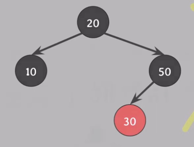

[쉬운 코드 - Red-Black Tree](https://www.youtube.com/watch?v=2MdsebfJOyM) 를 정리한 문서다.  

# BST

BST(이진 탐색 트리)는 탐색, 삽입, 삭제 연산을 O(log n) 시간에 수행할 수 있지만, 삽입/삭제 연산을 수행할 때마다 트리의 높이가 증가할 수 있어 최악의 경우 O(n) 시간이 걸릴 수 있다. 
이런 경우를 skewed tree(편향된 트리)라고 한다. 

BST 의 탐색 속도를 항상 O(log n)으로 유지하기 위해 왼쪽 오른쪽 서브 트리의 높이의 균형을 맞추기 위해 고안된 트리(self-balancing binary search tree) 중 `AVL Tree`와 `Red-Black Tree` 가 있다.

# Red-Black Tree

RB Tree 는 AVL Tree 보다 조금 더 많이 사용되는 self-balancing binary search tree 이다. 리눅스의 CPU 스케줄링, Java 의 hasMap, hashSet 등이 Red-Black Tree 로 구현되어 있다.

## Red-Black Tree 조건

다음의 조건을 만족하는 BST 를 Red-Black Tree 라고 한다. 

- rule 1) 각 노드는 red 또는 black 이라는 색깔을 가진다.
- rule 2) Root 노드는 black 이다.
- rule 3) 모든 leaf 노드는 black 이다.(NIL 노드)
- rule 4) red 노드의 자식 노드는 black 이다.
- rule 5) 어떤 노드로부터 leaf 노드까지의 모든 경로에는 동일한 개수의 black 노드가 존재한다.

## Red-Black 트리 높이 

> [신찬수 - 자료구조 - 균형탐색이진트리 - Red-Black 트리](https://www.youtube.com/watch?v=SHdYv41iCmE)

Red-Black Tree 의 높이는 최대 2log(n+1) 으로, 탐색시 O(log n) 의 시간복잡도를 보장한다.

- bh(𝑥): 특정 노드 x에서 해당 서브트리의 모든 리프 노드까지의 경로에서 만나는 `검정 노드`의 개수
- h(x): 특정 노드 x에서 해당 서브트리의 리프 노드까지의 경로에서 만나는 `모든 노드`의 개수
- n: 모든 노드의 개수

rule 4 에 의해 n 개의 노드 중 black 노드의 개수는 n/2 이상이다.  
- =>`h(x) <= 2bh(x)` 

rule 5 에 의해 모든 leaf 노드까지 동일한 개수의 black 노드가 존재한다.
따라서, black 노드의 개수는 `2^(bh(x)) - 1` 이기 때문에, 전체 노드 개수(n)는 최소 `2^(bh(x)) - 1` 이다.
- => `n >= 2^(bh(x)) - 1`

그리고, 전체 노드의 개수는 Perfact Binary Tree 의 노드 개수 이하이다.
- => `n <= 2^h(x) - 1`

도출된 3가지 식을 이용하면 다음과 같은 식을 유도할 수 있다.


따라서, Red-Black Tree 의 높이는 최대 `2log(n+1)` 이고, 탐색시 `O(log n)` 의 시간복잡도를 보장한다.


## Red-Black Tree 의 삽입

기본적으로 BST 의 삽입과 동일하다.

1) BST 의 삽입과 동일하게 삽입한다.
2) 삽입한 노드의 색깔은 red 다.

> 🤔 삽입하는 노드가 왜 red 임??  
> 삽입 후에도 rule 5 를 만족하기 위해 red 로 삽입한다.

이제 부터 BST 와 조금 달라진다. 위 Red-Black Tree 의 조건을 위배하지 않을 경우 삽입이 종료 된다.

3) 삽입한 뒤 Red-Black Tree 의 조건을 위배하지 않는지 확인한다.  
4) 삽입한 노드의 부모 노드가 black 이라면 종료한다.

그러나, 만약 삽입한 노드의 부모 노드가 red 라면 4번 rule 위반으로 인해 조정이 필요하다.
룰을 위반한 case 는 총 4가지가 있다.

## 트리의 회전

Red-Black Tree 의 삽입 조정 case에 대해 알아보기 전에 트리의 회전에 대해 알아보자.

### Left Rotation
- 기준 노드의 오른쪽 자식이 기준 노드의 자리를 차지
- 기준 노드는 오른쪽 자식의 왼쪽 자식으로 이동
- 오른쪽 자식의 왼쪽 자식은 기준 노드의 오른쪽 자식으로 이동

```
    10(N)
   /  \
  5   20(R)
     /  \
15(RL)  30
```
위 트리에서 10을 기준으로 왼쪽으로 회전할 경우, 20이 root 노드가 되고 10이 20의 왼쪽 자식 노드가 된다.

```
    20(R)
   /  \
10(N)  30
 /  \
5   15(RL)
```

### Right Rotation

- 왼쪽 자식이 기준 노드의 자리를 차지
- 기준 노드가 왼쪽 자식의 오른쪽 자식으로 이동
- 왼쪽 자식의 오른쪽 자식은 기준 노드의 왼쪽 자식으로 이동

```
    20(N)
   /  \
 10(L)  30
 /  \
5   15(LR)
```

20을 기준으로 오른쪽으로 회전할 경우, 10이 root 노드가 되고 20이 10의 오른쪽 자식 노드가 된다.

```
    10(L)
   /  \
  5   20(N)
     /  \
  15(LR)  30
```

## Case 1)

- 삽입한 노드가 root 노드인 경우

Red-Black Tree 의 rule 2 에 의해 root 노드는 black 이어야 한다.   
따라서 삽입한 노드의 색깔을 black 으로 변경 해야한다.

## Case 2)


- 부모의 노드, 삼촌 노드(부모의 형제 노드): red

rule 4 과 rule 5를 동시에 지키기 위해, 부모와 삼촌 노드의 색깔을 black 으로 변경하고, 할아버지 노드의 색깔을 red 로 변경해준다.


이때, 할아버지 노드가 root 노드인 경우, 할아버지 노드의 색깔을 black 으로 변경한다.
만약, 할아버지 노드가 root 노드가 아닐 경우, `할아버지 노드`를 기준으로 다시 삽입 확인 과정을 거친다.


## ⭐ Case 3)

- 부모 노드: red
- 삼촌 노드: black
- 삽입 노드와 부모 노드의 위치(Left, Right) 가 `같은` 경우
  - ex) 삽입 노드: 부모 노드의 `왼쪽` 자식 노드, 부모 노드: 할아버지 노드의 `왼쪽` 자식 노드
  - ex) 삽입 노드: 부모 노드의 `오른쪽` 자식 노드, 부모 노드: 할아버지 노드의 `오른쪽` 자식 노드  


현재 10 이 삽입한 노드이고, 부모 노드 20 의 위치가 왼쪽이므로, case 3 이다. (삼촌 노드는 NIL 노드로 black 이다.)


부모와 할아버지 노드의 색을 바꾼다.


그리고 할아버지 노드 기준으로 오른쪽으로 회전한다.

그리고, 20 노드의 오른쪽 자식을 회전 후 할아버지 노드의 왼쪽 자식으로 20 노드의 오른쪽 자식을 넣어준다.

그림으로 표현하면 다음과 같다.


왼쪽의 경우는 오른쪽의 경우와 반대로 진행한다.


### Case 3 해결법 정리
(왼쪽으로 Red 가 몰려있는 경우)

1. 부모와 할아버지 노드의 색을 바꾼다.
2. 할아버지 노드 기준으로 오른쪽으로 회전한다.
3. 회전 후, 할아버지 노드의 왼쪽 자식으로 부모 노드의 오른쪽 자식을 넣어준다.

(오른쪽으로 Red 가 몰려있는 경우)

1. 부모와 할아버지 노드의 색을 바꾼다.
2. 할아버지 노드 기준으로 왼쪽으로 회전한다.
3. 회전 후, 할아버지 노드의 오른쪽 자식으로 부모 노드의 왼쪽 자식을 넣어준다.

## Case 4

Case 4는 Case 3 으로 변환하여 해결한다.

- 부모 노드: red
- 삼촌 노드: black
- 삽입 노드와 부모 노드의 위치(Left, Right) 가 `다른` 경우
    - ex) 삽입 노드: 부모 노드의 `왼쪽` 자식 노드, 부모 노드: 할아버지 노드의 `오른쪽` 자식 노드
    - ex) 삽입 노드: 부모 노드의 `오른쪽` 자식 노드, 부모 노드: 할아버지 노드의 `왼쪽` 자식 노드  


Case 3과 다른 점은 삽입 노드에서 할아버지 노드까지 가는 경로가 꺾여있다.  

먼저, 삽입 노드 40의 부모 노드의 20을 기준으로 왼쪽으로 회전한다.
그리고, 삽입 노드의 왼쪽 자식을 부모 노드의 오른쪽 자식으로 넣어준다.


그럼 Case 3으로 변환된다.