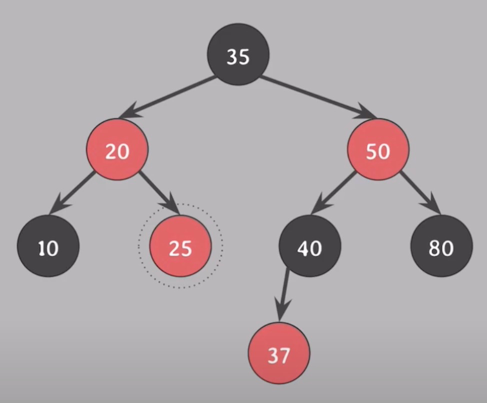

[쉬운 코더 - 레드 블랙 트리 삭제](https://www.youtube.com/watch?v=6drLl777k-E)를 정리한 글이다.

## Red-Black Tree 의 삭제

Red-Black Tree 의 삭제 방식은 일반 [BST 삭제 방식](BST_Delete.md)과 동일하다.
다만, Red-Black Tree 는 Self-Balancing Tree 이기 때문에 삭제 후에도 Red-Black Tree 의 조건을 만족해야 한다.

Red-Black Tree 의 삭제 프로세스는 다음과 같다.

```
1. 삭제하기 전 BST 는 Red-Black Tree 의 조건을 만족한 상태이다.
2. 일반 BST와 동일하게 노드를 삭제한다. 
3. Red-Black Tree 의 조건을 만족하는지 조사
4. 만족하지 않으면 조건을 만족할 때까지 조정
```

일단, 2번 과정인 삭제 방식에 대해 알아보자.

## 2번 과정: Red-Black Tree 의 삭제 방식

Red-Black Tree 에서 특정 노드가 삭제될 때 `어떤 노드의 색이 삭제`되는지가 매우 중요하다. 삭제되는 색에 따라 Red-Black Tree의 조건을 만족하는지 여부가 결정되기 때문이다.

삭제되는 색은 2가지 경우로 나뉜다. 아래 그림을 통해 이해해보자.


### case 1) 삭제하려는 노드의 자식의 개수가 0개나 1개인 경우

> 여기서 말하는 자식의 개수는 NIL 노드를 포함하지 않는다.

삭제하려는 노드의 자식 노드가 0개나 1개인 경우, `삭제되는 노드의 색`을 삭제한다.

10 삭제 -> Black 삭제  
80 삭제 -> Black 삭제
40 삭제 -> Black 삭제


### case 2) 삭제하려는 노드의 자식의 개수가 2개인 경우

이러한 경우, Red-Black Tree 에서는 실제로 삭제되는 노드의 색을 삭제하지 않는다. 대신 `successor` 노드의 색을 삭제한다.

35 삭제 -> successor 노드 37 -> Red 삭제
50 삭제 -> successor 노드 80 -> Black 삭제

이제 삭제되는 색을 결정 지었으니 3번 과정인 Red-Black Tree 의 조건을 만족하는지 확인해보자.  

## 3번 과정: Red-Black Tree 의 조건을 만족하는지 확인

삭제되는 color 의 색이 Red 일 경우, Red-Black Tree 의 모든 조건을 만족한다. 따라서, 추가적인 작업이 필요하지 않다.  

삭제될 노드의 색이 Black 일 경우가 매우 복잡하다.  
Black을 삭제할 경우 Red-Black Tree 의 경우 아래 3가지 조건을 만족하지 않을 수 있다.

```
rule 2) Root 노드는 black 이다.
rule 4) red 노드의 자식 노드는 black 이다.
rule 5) 어떤 노드로부터 leaf 노드까지의 모든 경로에는 동일한 개수의 black 노드가 존재한다.
```

아까 그림을 통해 이해해보자.


40을 삭제하면 Black 이 삭제된다. 이때, 50 노드의 자식이 37 노드가 되므로 rule 4를 위반한다.

이제, 4번 과정인 Red-Black Tree 의 조건을 만족할 때까지 조정하는 방법을 알아보자.

## 4번 과정: Red-Black Tree 의 조건을 만족할 때까지 조정

red-black Tree 의 삭제 조정은 크게 6가지 경우로 나뉜다.

- root 노드가 red 인 경우(1): root 노드의 red 를 black 으로 변경하면 된다.  


root 노드가 red 인 경우를 제외(2~6)할 경우, 모두 rule 5를 위반한다.   

이는, black 노드를 삭제했기 때문에 삭제한 노드의 반대 방향 서브트리와의 bh(Black Height) 가 달라지기 떄문이다.
이런 경우 `extra black` 이라는 개념을 도입한다.

### extra black

`extra black`은 rule 5번을 만족하기 위해 삭제된 노드의 위치에 extra black 이 추가되는 것을 의미한다. 그리고, extra black 을 부여 받은 노드는 `doubly black` or `red-and-black` 이 된다.  

예시를 통해 `doubly black` 과 `red-and-black` 을 이해해보자.

### doubly black

그림을 통해 이해해보자


10번 노드가 삭제


10번 노드가 NIL 노드로 대체 -> rule 5를 만족하기 위해 extra black 이 추가


NIL 노드는 `doubly Black` 이 된다.

`doubly black` 이란 black 노드에 `extra black` 이 추가된 상태를 의미한다. 

### red-and-black

이번엔 다른 예시를 보자


30번 노드와 black 이 삭제되고, 25번 노드가 삭제된 노드의 위치로 이동



black 이 삭제되었기 때문에, extra black 이 추가된다.


25번 노드는 `red-and-black` 이 된다.

`red-and-black` 이란 red 노드에 `extra black` 이 추가된 상태를 의미한다.
이때, `red-and-black` 은 `black` 으로 변경할 수 있다.  

  

이제, Red-Black Tree 의 조건을 만족 한다.  
이게 2번째 조정 case 이다.

## 중간 정리)

Red-Black Tree 의 조정은 6 가지 경우 나뉜다 했고, 2가지 경우를 알아보았다.

- root 노드가 red 인 경우 -> root 노드의 red 를 black 으로 변경
- red-and-black 인 경우 -> red-and-black 을 black 으로 변경

이제 나머지 4개의 경우는 `doubly black` 인 경우이다.
`doubly black` 을 조정하는 방법이 핵심이고 복잡한데, 이를 외우려고 하지말고 아이디어만 이해하면 시간이 지나도 바로 적용할 수 있다.  

## ⭐️ doubly black 조정 아이디어

rule 5 위반을 피하기 위해 `extra black` 을 부여할 경우, `doubly black` 가 생길 수 있다 했다. 그럼, `doubly black`은 어떻게 조정할까? 🤔  

바로, doubly black 의 `extra black 을 다른 red 노드에 넘겨주는 방식`으로 조정한다.  

좀 더 구체화하자면, 반대편 서브 트리에 있는 red 노드를 `doubly black` 이 있는 노드의 부모 노드로 이동을 시킨 후,
extra black 을 부모로 전파하여 `double black` 을 제거하는 방식이다.

## ⭐️ doubly black 조정 방법

`doubly black` 을 조정하는 방법은 `4가지 case` 로 나뉘고, 아래와 같은 기준으로 선정된다.

1) doubly black 노드의 형제 노드 color
2) 형제 노드의 자식 노드들의 color

이제, 4가지 case 를 알아보자.

## Case 4 해결 방법

Case 4번은 아래와 같다.

- 형제 노드의 color : black
- 형제 노드의 오른쪽 자식 노드 color : red
- 부모와 형제 노드의 왼쪽 자식 노드 color : black or red (상관 없음)

그림으로 나타내면 아래와 같다.


목표는 E 노드를 doubly black 의 부모 노드로 이동시키는 것이다.  
그럼, 예시를 통해 이해해보자.
 
E,C,D 노드의 색을 반전


B, D 노드의 색을 변경


B 노드를 기준으로 왼쪽 회전


B,A,C 노드 색 반전 (double black 제거)


Case 4 삭제 조정 끝!


정리하면 다음과 같다.  

1) 형제와 형제 자식 노드의 색 반전(변경)
2) 형제와 부모 색 변경
3) 부모 기준 왼쪽 회전
4) doubly black 과 double black 의 부모와 색을 변경

이 과정을 최소화 하면 아래와 같이 나타낼 수 있다.

1) 형제는 부모색, 형제의 오른쪽 자식 black, 부모의 색 black 으로 변경
2) 부모 기준으로 왼쪽 회전

> 위 과정이 rule 5를 위반하지 않는지 검증을 하고 싶다면
> 초기 상태의 black 노드들이 이동하는 과정을 추적하면 된다.  

## Case 3 해결 방법

Case 3번은 아래와 같다.

- 부모 노드 color : black or red (상관 없음)
- 형제 노드의 color : black
- 형제 노드의 오른쪽 자식 노드 color : black
- 형제 노드의 왼쪽 자식 노드 color : red

그림으로 나타내면 다음과 같다


 
목표는 Case 3번을 Case 4번으로 변환한 후, Case 4 방식으로 해결하는 것이다.  
예시를 통해 이해해보자.


C, D 노드의 색을 반전


D 를 기준으로 오른쪽 회전


이제 위 상황은 Case 4로 변환되었다.

정리 하면 다음과 같다.

1. 형제의 왼쪽 자식 노드와 부모의 색을 변경
2. 형제 노드 기준으로 오른쪽 회전

## Case 2 해결 방법

Case 2번은 아래와 같다.

- 부모 노드 color : black or red (상관 없음)
- 형제 노드 와 형제 자식 노드 color : black

그림으로 나타내면 다음과 같다


Case 2번 해결 방법은 매우 간단하다.  
extra black 을 부모 노드로 이동시키는 것이다.

A, B, D 의 색을 반전시킨다.  


black 을 전달 받은 부모의 노드는 `red-and-black` or `doubly black` 이 된다.

1) `red-and-black` 인 경우 -> `black` 으로 변경
2) 부모가 root 이고, `doubly black` 인 경우 -> `black` 으로 변경
3) 부모가 root 가 아니고, `doubly black` 인 경우 -> 부모를 기준으로 다시 삭제 조정

## Case 1 해결 방법

Case 1번은 아래와 같다.

- 부모 노드 color : black
- 형제 노드의 color : red
- 형제 노드의 자식 노드 color : black

그림으로 나타내면 다음과 같다


목표는 doubly black 의 형제를 black 으로 변경한 후, Case 2,3,4 로 변환하는 것이다.

예시를 통해 이해해보자.

B, D 의 색을 반전


B 노드를 기준으로 왼쪽 회전


이제 다시 doubly black 의 케이스 검사를 통해 Case 2,3,4 로 해결한다.

> doubly black 의 조정의 핵심은 2가지다.
> 
> 1) `extra black` 을 다른 red 노드로 이동시키는 것
> 2) red 노드가 없다면 `extra black` 을 부모 노드로 이동시키는 것
> 
> 이것만 기억하면, 과정을 까먹어도 바로 구현할 수 있을 것이다~   
> 쉬운 코딩님 감사합니다 🙇‍♂️