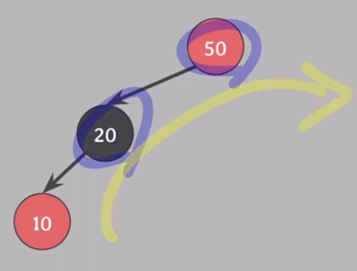
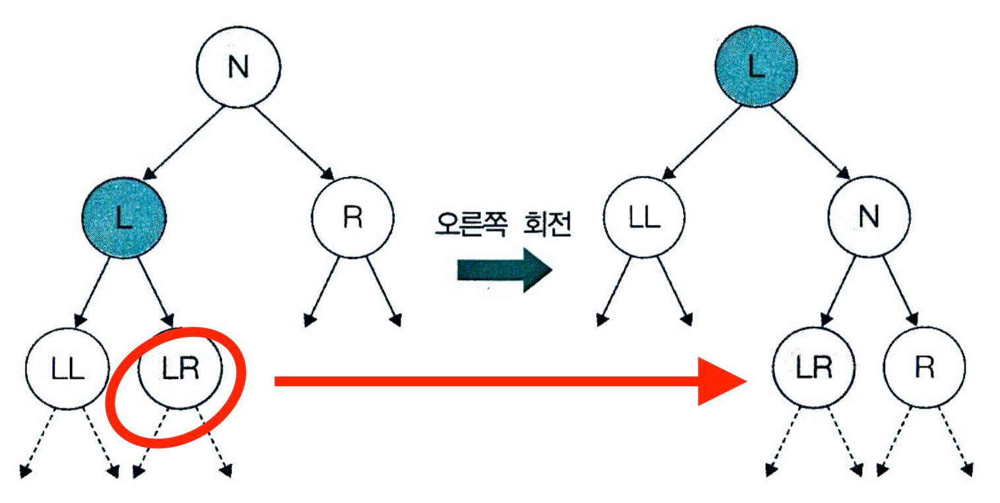
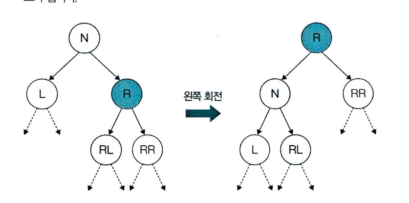
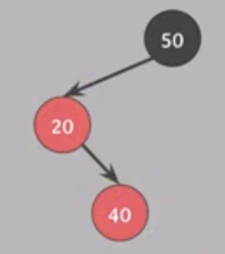
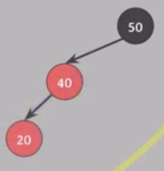

## Red-Black Tree 의 삽입

기본적으로 BST 의 삽입과 동일하다.

1) BST 의 삽입과 동일하게 삽입한다.
2) 삽입한 노드의 색깔은 red 다.

> 🤔 삽입하는 노드가 왜 red 임??  
> 삽입 후에도 rule 5 를 만족하기 위해 red 로 삽입한다.

이제 부터 BST 와 조금 달라진다. 위 Red-Black Tree 의 조건을 위배하지 않을 경우 삽입이 종료 된다.

3) 삽입한 뒤 Red-Black Tree 의 조건을 위배하지 않는지 확인한다.
4) 삽입한 노드의 부모 노드가 black 이라면 종료한다.

그러나, 만약 삽입한 노드의 부모 노드가 red 라면 4번 rule 위반으로 인해 조정이 필요하다.
룰을 위반한 case 는 총 4가지가 있다.

# Red-Black Tree 의 삽입 조정

- 삽입한 노드가 root 노드인 경우

Red-Black Tree 의 rule 2 에 의해 root 노드는 black 이어야 한다.   
따라서 삽입한 노드의 색깔을 black 으로 변경 해야한다.

삽입 조정은 크게 3가지 case 로 나눌 수 있다.

> 삽입 조정 시 Tree 의 회전을 사용한다.
> Tree 의 회전에 대해서는 [트리의 회전](./TreeRotate.md) 에서 확인할 수 있다.

## Case 1)

- 부모의 노드, 삼촌 노드(부모의 형제 노드): red

rule 4 과 rule 5를 동시에 지키기 위해, 부모와 삼촌 노드의 색깔을 black 으로 변경하고, 할아버지 노드의 색깔을 red 로 변경해준다.

이때, 할아버지 노드가 root 노드인 경우, 할아버지 노드의 색깔을 black 으로 변경한다.
만약, 할아버지 노드가 root 노드가 아닐 경우, `할아버지 노드`를 기준으로 다시 삽입 확인 과정을 거친다.

## ⭐ Case 3)

- 부모 노드: red
- 삼촌 노드: black
- 삽입 노드와 부모 노드의 위치(Left, Right) 가 `같은` 경우
    - ex) 삽입 노드: 부모 노드의 `왼쪽` 자식 노드, 부모 노드: 할아버지 노드의 `왼쪽` 자식 노드
    - ex) 삽입 노드: 부모 노드의 `오른쪽` 자식 노드, 부모 노드: 할아버지 노드의 `오른쪽` 자식 노드

현재 10 이 삽입한 노드이고, 부모 노드 20 의 위치가 왼쪽이므로, case 3 이다. (삼촌 노드는 NIL 노드로 black 이다.)

부모와 할아버지 노드의 색을 바꾼다.

그리고 할아버지 노드 기준으로 오른쪽으로 회전한다.

그리고, 20 노드의 오른쪽 자식을 회전 후 할아버지 노드의 왼쪽 자식으로 20 노드의 오른쪽 자식을 넣어준다.

그림으로 표현하면 다음과 같다.

왼쪽의 경우는 오른쪽의 경우와 반대로 진행한다.

### Case 3 해결법 정리
(왼쪽으로 Red 가 몰려있는 경우)

1. 부모와 할아버지 노드의 색을 바꾼다.
2. 할아버지 노드 기준으로 오른쪽으로 회전한다.
3. 회전 후, 할아버지 노드의 왼쪽 자식으로 부모 노드의 오른쪽 자식을 넣어준다.

(오른쪽으로 Red 가 몰려있는 경우)

1. 부모와 할아버지 노드의 색을 바꾼다.
2. 할아버지 노드 기준으로 왼쪽으로 회전한다.
3. 회전 후, 할아버지 노드의 오른쪽 자식으로 부모 노드의 왼쪽 자식을 넣어준다.

## Case 2

Case 2는 Case 3 으로 변환하여 해결한다.

- 부모 노드: red
- 삼촌 노드: black
- 삽입 노드와 부모 노드의 위치(Left, Right) 가 `다른` 경우
    - ex) 삽입 노드: 부모 노드의 `왼쪽` 자식 노드, 부모 노드: 할아버지 노드의 `오른쪽` 자식 노드
    - ex) 삽입 노드: 부모 노드의 `오른쪽` 자식 노드, 부모 노드: 할아버지 노드의 `왼쪽` 자식 노드

Case 3과 다른 점은 삽입 노드에서 할아버지 노드까지 가는 경로가 꺾여있다.

먼저, 삽입 노드 40의 부모 노드의 20을 기준으로 왼쪽으로 회전한다.
그리고, 삽입 노드의 왼쪽 자식을 부모 노드의 오른쪽 자식으로 넣어준다.

그럼 Case 3으로 변환된다.