# Navigation Compose 학습

Jetpack Compose Navigation 2를 학습테스트 방식으로 탐구합니다.

- Test Tool: Robolectric + `createComposeRule()` (JVM 기반, 에뮬레이터 불필요)
- Navigation 버전: 2.9.6
- 공식 문서: https://developer.android.com/develop/ui/compose/navigation

---

## Phase 1: 핵심 개념 정리

### 1. NavHost와 NavController의 역할

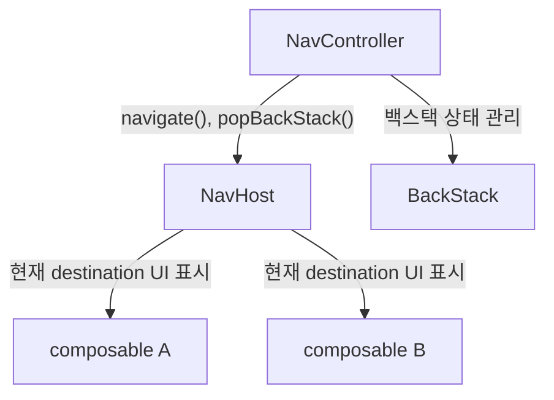

- **NavController** — `navigate()`, `popBackStack()` 등 탐색 동작을 제어하는 중앙 API
- **NavHost** — 탐색 그래프 컨테이너. 어떤 화면이 존재하는지 정의하고, 현재 destination의 UI를 표시
- **composable\<T\>** — NavHost 내에서 개별 화면을 등록

> 출처: [Navigation Compose 공식 문서](https://developer.android.com/develop/ui/compose/navigation)

```kotlin
val navController = rememberNavController()

NavHost(navController = navController, startDestination = Home) {
    composable<Home> { HomeScreen(...) }
    composable<Profile> { backStackEntry ->
        val profile = backStackEntry.toRoute<Profile>()
        ProfileScreen(profile.id)
    }
}
```

**JetNews**에서는 `JetnewsNavGraph` 함수에서 NavHost를 정의하고, `rememberNavController()`로 생성한 NavController를 외부에서 주입받는 패턴을 사용한다.

---

### 2. Type-Safe Navigation (@Serializable 기반)

Navigation 2.8.0부터 도입. 문자열 기반 라우트의 런타임 오류를 컴파일 타임에 방지한다.

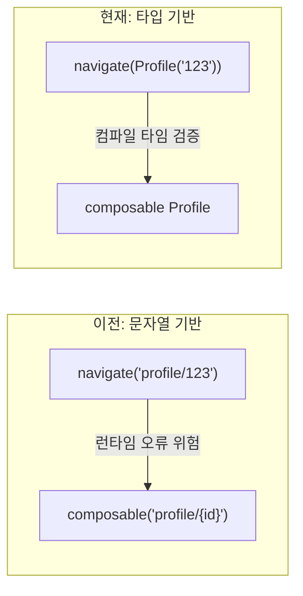

```kotlin
// 라우트 정의
@Serializable object Home
@Serializable data class Profile(val id: String)

// 화면 이동 — 타입 안전
navController.navigate(Profile(id = "user123"))

// 인자 추출 — 자동 역직렬화
val profile = backStackEntry.toRoute<Profile>()
```

**핵심 규칙 (공식 문서):** 복잡한 객체를 통째로 전달하지 말고, ID만 전달 → ViewModel에서 로드

```kotlin
class ProfileViewModel(savedStateHandle: SavedStateHandle) : ViewModel() {
    private val profile = savedStateHandle.toRoute<Profile>()
    val userInfo = repository.getUserInfo(profile.id)
}
```

> 출처: [Type-Safe Navigation 공식 문서](https://developer.android.com/guide/navigation/design/type-safety)

---

### 3. 백스택 관리 — popBackStack vs navigateUp vs popUpTo

| | `popBackStack()` | `navigateUp()` | `popUpTo` |
|--|--|--|--|
| 동작 | 백스택에서 현재 화면 제거 | 논리적 상위 화면으로 이동 | 지정 화면까지 백스택 정리 |
| 용도 | 프로그래밍적 뒤로가기 | AppBar 뒤로 버튼 | 로그인 완료 등 흐름 정리 |
| 딥링크 시 | 백스택 비면 아무것도 안 함 | 호출 앱으로 복귀 | - |

> 출처: [NowInAndroid Issue #1817](https://github.com/android/nowinandroid/issues/1817) — 툴바 뒤로 버튼에는 `navigateUp()` 권장

**popUpTo + inclusive 시각화:**

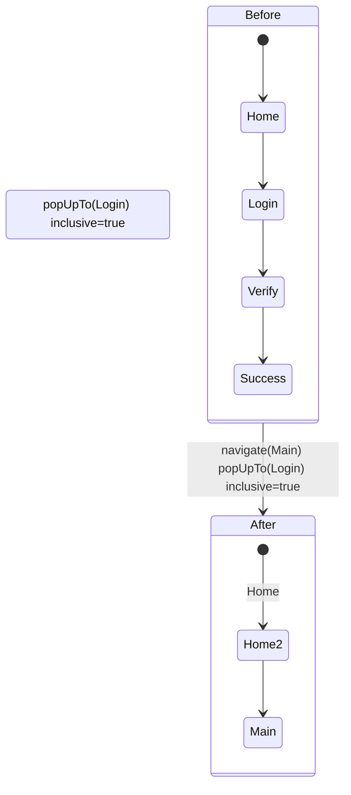

```kotlin
// 로그인 완료 후: Login 포함 전부 제거 → Main으로
navController.navigate(Main) {
    popUpTo(Login) { inclusive = true }
}

// 하단 탭 전환: 홈 중복 방지
navController.navigate(Home) {
    popUpTo(Home) { inclusive = true }
    launchSingleTop = true
}
```

- `inclusive = true` — popUpTo 대상 화면 포함하여 제거
- `inclusive = false` — popUpTo 대상 화면은 유지, 그 위만 제거
- `launchSingleTop = true` — 같은 화면 중복 생성 방지

---

### 4. 멀티모듈 Navigation 캡슐화 패턴

NowInAndroid가 Navigation 2 시절 사용한 핵심 아키텍처 패턴.

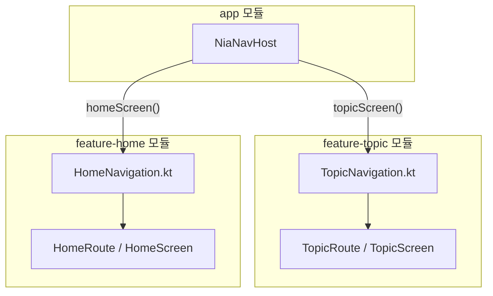

> 출처: [Encapsulate Navigation 공식 문서](https://developer.android.com/guide/navigation/design/encapsulate)

```kotlin
// feature 모듈: NavGraphBuilder 확장으로 destination 캡슐화
fun NavGraphBuilder.topicScreen(onBackClick: () -> Unit) {
    composable<TopicRoute> { backStackEntry ->
        val route = backStackEntry.toRoute<TopicRoute>()
        TopicScreen(topicId = route.id, onBackClick = onBackClick)
    }
}

// feature 모듈: NavController 확장으로 navigation 이벤트 캡슐화
fun NavController.navigateToTopic(id: String) {
    navigate(TopicRoute(id = id))
}

// app 모듈: 그래프 조립
NavHost(navController, startDestination = HomeRoute) {
    homeScreen(onTopicClick = { id -> navController.navigateToTopic(id) })
    topicScreen(onBackClick = { navController.popBackStack() })
}
```

**핵심:** feature 모듈이 NavController에 직접 의존하지 않음 → 콜백 기반 독립 테스트 가능

---

### 5. DeepLink

외부 URI로 앱의 특정 화면에 직접 진입하는 기능.

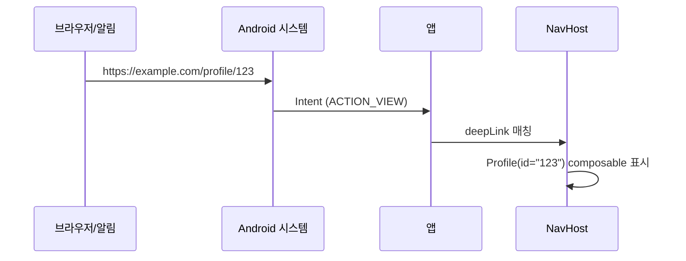

```kotlin
composable<Profile>(
    deepLinks = listOf(
        navDeepLink<Profile>(basePath = "https://example.com/profile")
    )
) { backStackEntry ->
    val profile = backStackEntry.toRoute<Profile>()
    ProfileScreen(profile.id)
}
```

AndroidManifest에 intent-filter 설정 필요:
```xml
<intent-filter>
    <action android:name="android.intent.action.VIEW" />
    <category android:name="android.intent.category.DEFAULT" />
    <category android:name="android.intent.category.BROWSABLE" />
    <data android:scheme="https" android:host="example.com" />
</intent-filter>
```

> 출처: [Navigation Compose 공식 문서 - Deep Links](https://developer.android.com/develop/ui/compose/navigation),
> [JetNews JetnewsNavGraph.kt](https://github.com/android/compose-samples/blob/main/JetNews/app/src/main/java/com/example/jetnews/ui/JetnewsNavGraph.kt)

---

### 6. launchSingleTop과 같은 destination + 다른 인자

**Q: `Route(id=1)` → `Route(id=2)` 하면 별도 백스택? `launchSingleTop`이면?**

`composable<Route>`는 **Route 타입 하나**를 destination으로 등록한다.
`Route(id=1)`과 `Route(id=2)`는 **같은 destination, 다른 arguments**일 뿐이다.

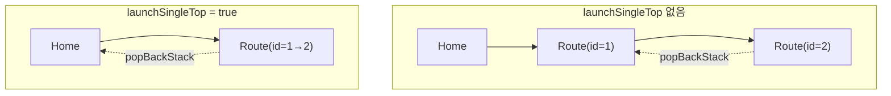

| 시나리오 | 백스택 결과 |
|---------|-----------|
| `navigate(Item(1))` → `navigate(Item(2))` | Home → Item(1) → Item(2) **별도 엔트리** |
| `navigate(Item(1))` → `navigate(Item(2)) { launchSingleTop=true }` | Home → Item(2) **인자만 갱신** |
| `navigate(Item(1))` → `navigate(Item(1))` (singleTop 없음) | Home → Item(1) → Item(1) **같은 인자도 중복** |

**핵심:**
- `launchSingleTop`은 **인자값을 비교하지 않는다** — destination 타입만 본다
- top이 같은 destination이면 새 엔트리를 만들지 않고, 기존 엔트리의 arguments를 교체한다
- top이 다른 destination이면 `launchSingleTop`이어도 정상적으로 새 엔트리가 쌓인다

**테스트 파일:** `LaunchSingleTopTest.kt`

---

### 7. SavedStateHandle과 Navigation

**Q: SavedStateHandle은 언제 들어와? 테스트로 어떻게 검증?**

각 `NavBackStackEntry`마다 독립적인 `SavedStateHandle`이 존재한다.

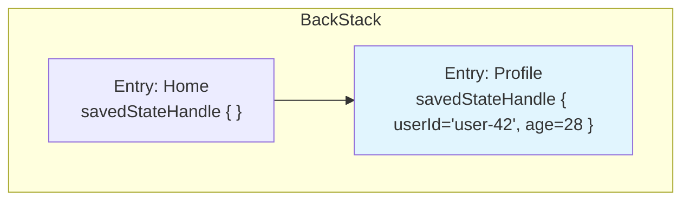

**1) Route 인자 자동 주입**

`@Serializable` route의 프로퍼티 이름이 SavedStateHandle의 key가 된다.

```kotlin
// navigate(ProfileRoute(userId = "user-42", age = 28))
backStackEntry.savedStateHandle.get<String>("userId")  // → "user-42"
backStackEntry.savedStateHandle.get<Int>("age")         // → 28
```

**2) 이전 화면에 결과 전달 (Result 패턴)**

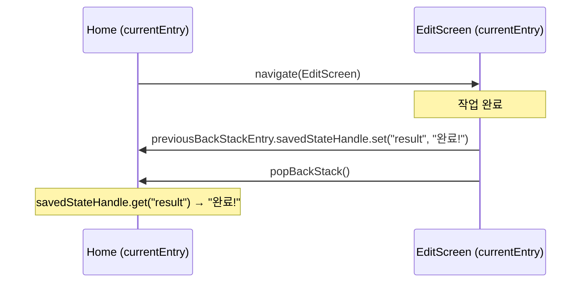

```kotlin
// EditScreen에서 결과 전달
navController.previousBackStackEntry?.savedStateHandle?.set("edit_result", "수정 완료!")
navController.popBackStack()

// Home에서 결과 수신
val result = backStackEntry.savedStateHandle.get<String>("edit_result")
```

> 출처: [공식 문서 - Returning a result](https://developer.android.com/guide/navigation/navigation-programmatic#returning_a_result)

**3) 각 엔트리는 독립적**
- Home의 savedStateHandle에 넣은 값은 EditScreen에서 보이지 않는다
- `currentBackStackEntry`는 navigate 전후로 다른 엔트리를 가리킨다
- `previousBackStackEntry`로 이전 화면의 엔트리에 접근 가능

**테스트 파일:** `SavedStateHandleTest.kt`

---

### 8. saveState / restoreState (하단 탭 전환 패턴)

**Q: 탭 전환 시 각 탭의 백스택을 어떻게 보존하나?**

`saveState`와 `restoreState`는 **하단 탭 내비게이션**에서 각 탭의 독립적인 백스택을 유지하는 핵심 옵션이다.

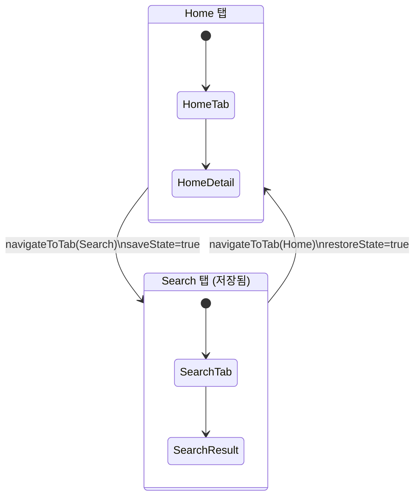

```kotlin
// 하단 탭 전환 패턴 — NowInAndroid 스타일
navController.navigate(selectedTab) {
    popUpTo<StartDestination> {
        saveState = true      // 현재 탭의 백스택을 저장
    }
    launchSingleTop = true    // 같은 탭 중복 방지
    restoreState = true       // 이전 탭의 백스택을 복원
}
```

| 옵션 | 기본값 | 역할 |
|------|--------|------|
| `saveState` | `false` | popUpTo로 제거되는 백스택을 메모리에 저장 |
| `restoreState` | `false` | 이전에 저장된 백스택을 복원 |
| `launchSingleTop` | `false` | 같은 destination 중복 생성 방지 |

**saveState 없으면?**
- 탭 전환 후 돌아왔을 때 탭 루트부터 다시 시작
- 사용자가 탐색했던 내부 화면(Detail 등)이 소실됨

> 출처: [공식 문서 - Back stack state](https://developer.android.com/guide/navigation/backstack#save-state)

**테스트 파일:** `SaveRestoreStateTest.kt`

---

### 9. SavedStateHandle 최신 API (getStateFlow, getMutableStateFlow, ViewModel 연동)

**Q: SavedStateHandle에서 Flow로 반환하거나 ViewModel이랑 연동하는 방법은?**

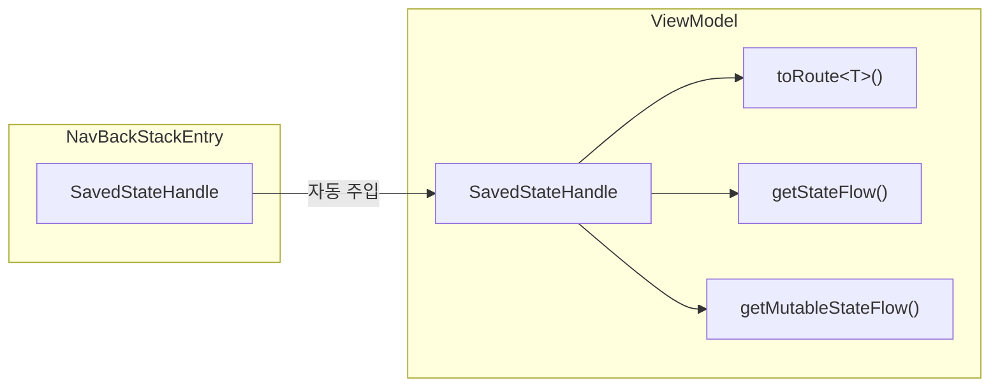

**1) getStateFlow — 읽기 전용 StateFlow**

```kotlin
// key에 대한 StateFlow를 반환 (값 변경 시 자동 갱신)
val userIdFlow: StateFlow<String> = savedStateHandle.getStateFlow("userId", "")
```

**2) getMutableStateFlow — 읽기/쓰기 MutableStateFlow**

```kotlin
// 직접 값을 수정할 수 있는 MutableStateFlow
val counter = savedStateHandle.getMutableStateFlow("counter", 0)
counter.value = counter.value + 1  // → SavedStateHandle에도 자동 반영
```

**3) ViewModel에서 toRoute\<T\>()로 Route 인자 추출**

```kotlin
class UserViewModel(savedStateHandle: SavedStateHandle) : ViewModel() {
    // Route 인자를 한 번에 추출
    private val route = savedStateHandle.toRoute<UserRoute>()
    val userId: String = route.userId

    // StateFlow로 관찰
    val userIdFlow: StateFlow<String> = savedStateHandle.getStateFlow("userId", "")

    // MutableStateFlow로 편집 가능한 상태
    val editableName = savedStateHandle.getMutableStateFlow("editableName", route.userName)
}
```

**4) 유틸리티 메서드**

| 메서드 | 설명 |
|--------|------|
| `keys()` | 저장된 모든 key 목록 |
| `contains(key)` | key 존재 여부 확인 |
| `remove(key)` | key 삭제 후 값 반환 |
| `get<T>(key)` | 값 조회 |
| `set(key, value)` / `[key] = value` | 값 저장 |

**테스트 파일:** `SavedStateHandleAdvancedTest.kt`

---

### 10. Nested Navigation Graph (중첩 탐색 그래프)

**Q: 서브 플로우(로그인, 온보딩 등)를 어떻게 캡슐화하나?**

`navigation<GraphRoute>(startDestination = ...)` DSL로 중첩 그래프를 생성한다.

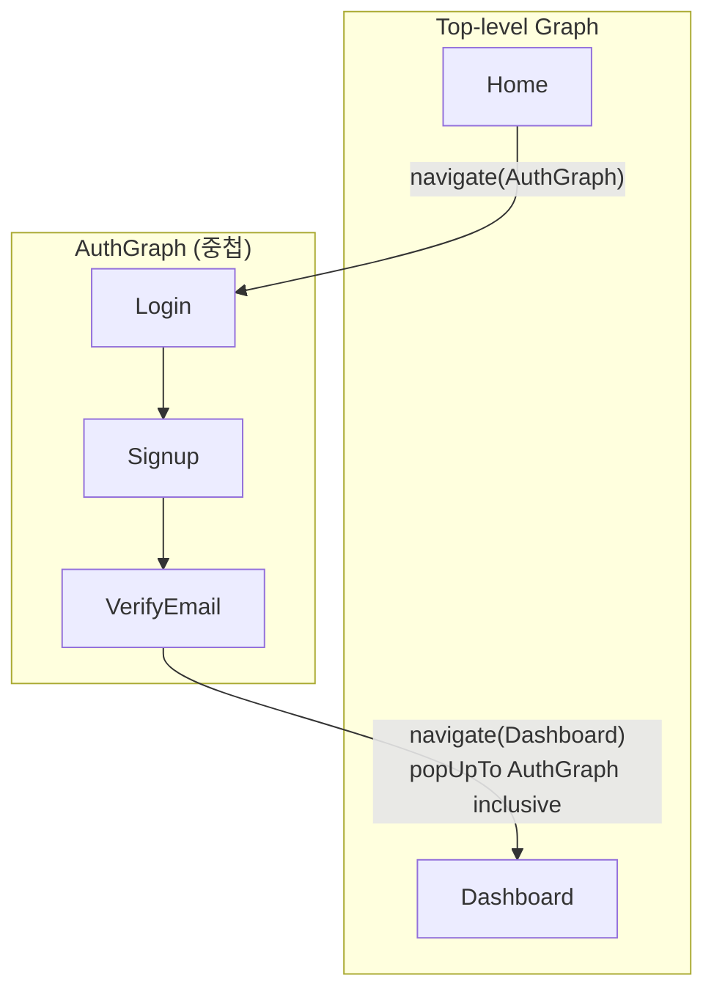

```kotlin
NavHost(navController, startDestination = Home) {
    composable<Home> { HomeScreen() }

    // Auth 중첩 그래프
    navigation<AuthGraph>(startDestination = Login) {
        composable<Login> { LoginScreen() }
        composable<Signup> { SignupScreen() }
        composable<VerifyEmail> { VerifyEmailScreen() }
    }

    composable<Dashboard> { DashboardScreen() }
}

// 외부에서 그래프로 navigate → startDestination(Login)이 표시됨
navController.navigate(AuthGraph)

// 그래프 전체 정리
navController.navigate(Dashboard) {
    popUpTo<AuthGraph> { inclusive = true }
}
```

**핵심:**
- `navigate(AuthGraph)` → 중첩 그래프의 `startDestination`이 표시됨
- 중첩 그래프 진입 시 백스택에 **그래프 엔트리 + startDestination** 2개가 추가됨
- `popUpTo<AuthGraph> { inclusive = true }` → 그래프 내부 화면 전부 정리
- 외부에서 내부 destination으로 직접 navigate도 가능 (Route는 전역)

> 출처: [Nested Navigation Graphs 공식 문서](https://developer.android.com/guide/navigation/design/nested-graphs)

**테스트 파일:** `NestedNavGraphTest.kt`

---

### 11. DeepLink Intent 처리 흐름 (Activity vs Navigation)

**Q: Activity와 Navigation에서 동시에 DeepLink를 처리하면 어떻게 되나?**

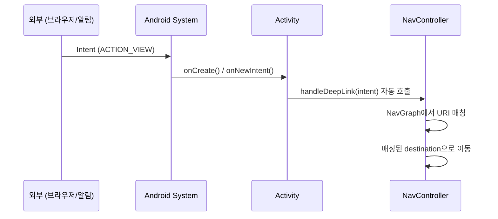

**핵심 동작:**

| launch mode | 처리 방식 |
|-------------|----------|
| `standard` (기본) | `NavController.handleDeepLink(intent)` **자동** 호출 |
| `singleTop` | `onNewIntent()`에서 **수동** `handleDeepLink()` 호출 필요 |

```kotlin
// singleTop일 때 수동 처리
override fun onNewIntent(intent: Intent?) {
    super.onNewIntent(intent)
    navController.handleDeepLink(intent)
}
```

**중복 처리 없음**: Activity의 `onCreate()`가 Intent를 처리하고 Navigation이 또 처리하는 게 아니라, **Navigation이 전담**한다. `handleDeepLink()`가 NavGraph에서 URI를 매칭하고 해당 destination으로 이동.

**`handleDeepLink()` 반환값:**
- `true` — URI 매칭 성공, destination으로 이동
- `false` — 매칭 실패, 아무 동작 안 함

> 출처: [Deep Link 공식 문서](https://developer.android.com/guide/navigation/design/deep-link)

**테스트 파일:** `DeepLinkHandlingTest.kt`

---

## 학습 순서

### 1단계: 기본 컴포넌트

NavHost, NavController, composable의 역할과 동작 방식을 학습합니다.

**테스트 파일:** `NavHostBasicTest.kt`, `TypeSafeNavigationTest.kt`

---

### 2단계: 백스택 동작

`popBackStack()`, `popUpTo`, `launchSingleTop`, `saveState/restoreState`를 학습합니다.

**테스트 파일:** `PopBackStackTest.kt`, `PopUpToTest.kt`, `LaunchSingleTopTest.kt`, `SaveRestoreStateTest.kt`

---

### 3단계: 상태 관리

SavedStateHandle, ViewModel 연동, Result 패턴을 학습합니다.

**테스트 파일:** `SavedStateHandleTest.kt`, `SavedStateHandleAdvancedTest.kt`

---

### 4단계: 구조화

Nested Navigation Graph로 서브 플로우를 캡슐화합니다.

**테스트 파일:** `NestedNavGraphTest.kt`

---

### 5단계: DeepLink

외부 URI 진입, handleDeepLink, Activity 연동을 학습합니다.

**테스트 파일:** `DeepLinkHandlingTest.kt`

---

## 테스트 실행

```bash
# Navigation 전체 테스트 (Robolectric - JVM)
./gradlew :compose-practice:test

# 특정 테스트 클래스 실행
./gradlew :compose-practice:test --tests "*.NavHostBasicTest"
./gradlew :compose-practice:test --tests "*.NestedNavGraphTest"
./gradlew :compose-practice:test --tests "*.DeepLinkHandlingTest"
```

---

## 참고 링크

- [Navigation Compose 공식 문서](https://developer.android.com/develop/ui/compose/navigation)
- [Type-Safe Navigation 공식 문서](https://developer.android.com/guide/navigation/design/type-safety)
- [Encapsulate Navigation 공식 문서](https://developer.android.com/guide/navigation/design/encapsulate)
- [Navigation Testing 공식 문서](https://developer.android.com/guide/navigation/testing)
- [NowInAndroid Navigation 구현](https://github.com/android/nowinandroid/tree/main/app/src/main/kotlin/com/google/samples/apps/nowinandroid/navigation)
- [JetNews Navigation](https://github.com/android/compose-samples/blob/main/JetNews/app/src/main/java/com/example/jetnews/ui/JetnewsNavGraph.kt)
- [NowInAndroid Issue #1817 - navigateUp vs popBackStack](https://github.com/android/nowinandroid/issues/1817)

---

## 다음 학습

- [ ] Navigation 3 (현재 알파) — Scene, NavBackStack API 변화 학습
