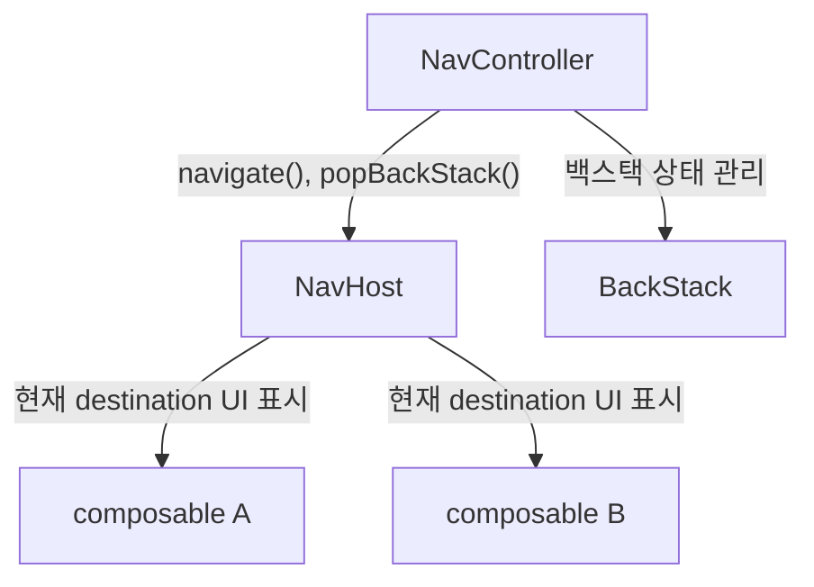
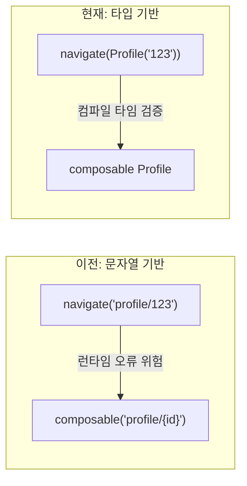
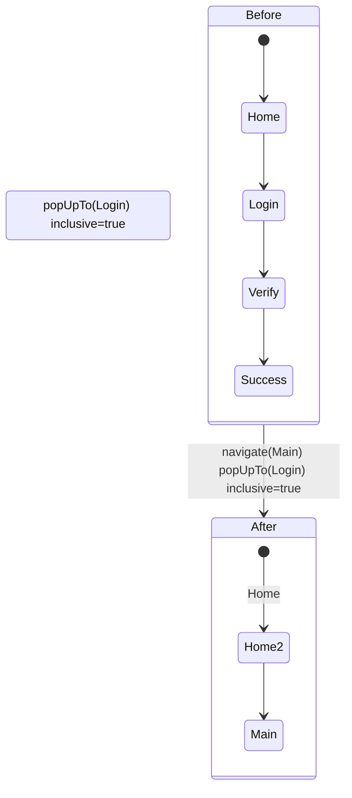
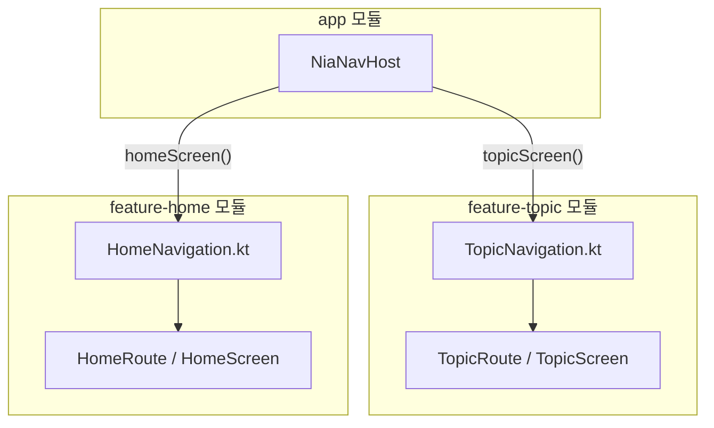
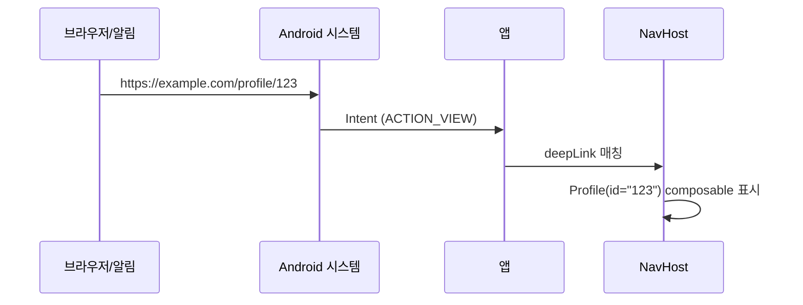

# Navigation Compose 학습

Jetpack Compose Navigation 2를 학습테스트 방식으로 탐구합니다.

- Test Tool: Robolectric + `createComposeRule()` (JVM 기반, 에뮬레이터 불필요)
- Navigation 버전: 2.9.6
- 공식 문서: https://developer.android.com/develop/ui/compose/navigation

---

## Phase 1: 핵심 개념 정리

### 1. NavHost와 NavController의 역할



- **NavController** — `navigate()`, `popBackStack()` 등 탐색 동작을 제어하는 중앙 API
- **NavHost** — 탐색 그래프 컨테이너. 어떤 화면이 존재하는지 정의하고, 현재 destination의 UI를 표시
- **composable\<T\>** — NavHost 내에서 개별 화면을 등록

> 출처: [Navigation Compose 공식 문서](https://developer.android.com/develop/ui/compose/navigation)

```kotlin
val navController = rememberNavController()

NavHost(navController = navController, startDestination = Home) {
    composable<Home> { HomeScreen(...) }
    composable<Profile> { backStackEntry ->
        val profile = backStackEntry.toRoute<Profile>()
        ProfileScreen(profile.id)
    }
}
```

**JetNews**에서는 `JetnewsNavGraph` 함수에서 NavHost를 정의하고, `rememberNavController()`로 생성한 NavController를 외부에서 주입받는 패턴을 사용한다.

---

### 2. Type-Safe Navigation (@Serializable 기반)

Navigation 2.8.0부터 도입. 문자열 기반 라우트의 런타임 오류를 컴파일 타임에 방지한다.



```kotlin
// 라우트 정의
@Serializable object Home
@Serializable data class Profile(val id: String)

// 화면 이동 — 타입 안전
navController.navigate(Profile(id = "user123"))

// 인자 추출 — 자동 역직렬화
val profile = backStackEntry.toRoute<Profile>()
```

**핵심 규칙 (공식 문서):** 복잡한 객체를 통째로 전달하지 말고, ID만 전달 → ViewModel에서 로드

```kotlin
class ProfileViewModel(savedStateHandle: SavedStateHandle) : ViewModel() {
    private val profile = savedStateHandle.toRoute<Profile>()
    val userInfo = repository.getUserInfo(profile.id)
}
```

> 출처: [Type-Safe Navigation 공식 문서](https://developer.android.com/guide/navigation/design/type-safety)

---

### 3. 백스택 관리 — popBackStack vs navigateUp vs popUpTo

| | `popBackStack()` | `navigateUp()` | `popUpTo` |
|--|--|--|--|
| 동작 | 백스택에서 현재 화면 제거 | 논리적 상위 화면으로 이동 | 지정 화면까지 백스택 정리 |
| 용도 | 프로그래밍적 뒤로가기 | AppBar 뒤로 버튼 | 로그인 완료 등 흐름 정리 |
| 딥링크 시 | 백스택 비면 아무것도 안 함 | 호출 앱으로 복귀 | - |

> 출처: [NowInAndroid Issue #1817](https://github.com/android/nowinandroid/issues/1817) — 툴바 뒤로 버튼에는 `navigateUp()` 권장

**popUpTo + inclusive 시각화:**



```kotlin
// 로그인 완료 후: Login 포함 전부 제거 → Main으로
navController.navigate(Main) {
    popUpTo(Login) { inclusive = true }
}

// 하단 탭 전환: 홈 중복 방지
navController.navigate(Home) {
    popUpTo(Home) { inclusive = true }
    launchSingleTop = true
}
```

- `inclusive = true` — popUpTo 대상 화면 포함하여 제거
- `inclusive = false` — popUpTo 대상 화면은 유지, 그 위만 제거
- `launchSingleTop = true` — 같은 화면 중복 생성 방지

---

### 4. 멀티모듈 Navigation 캡슐화 패턴

NowInAndroid가 Navigation 2 시절 사용한 핵심 아키텍처 패턴.



> 출처: [Encapsulate Navigation 공식 문서](https://developer.android.com/guide/navigation/design/encapsulate)

```kotlin
// feature 모듈: NavGraphBuilder 확장으로 destination 캡슐화
fun NavGraphBuilder.topicScreen(onBackClick: () -> Unit) {
    composable<TopicRoute> { backStackEntry ->
        val route = backStackEntry.toRoute<TopicRoute>()
        TopicScreen(topicId = route.id, onBackClick = onBackClick)
    }
}

// feature 모듈: NavController 확장으로 navigation 이벤트 캡슐화
fun NavController.navigateToTopic(id: String) {
    navigate(TopicRoute(id = id))
}

// app 모듈: 그래프 조립
NavHost(navController, startDestination = HomeRoute) {
    homeScreen(onTopicClick = { id -> navController.navigateToTopic(id) })
    topicScreen(onBackClick = { navController.popBackStack() })
}
```

**핵심:** feature 모듈이 NavController에 직접 의존하지 않음 → 콜백 기반 독립 테스트 가능

---

### 5. DeepLink

외부 URI로 앱의 특정 화면에 직접 진입하는 기능.



```kotlin
composable<Profile>(
    deepLinks = listOf(
        navDeepLink<Profile>(basePath = "https://example.com/profile")
    )
) { backStackEntry ->
    val profile = backStackEntry.toRoute<Profile>()
    ProfileScreen(profile.id)
}
```

AndroidManifest에 intent-filter 설정 필요:
```xml
<intent-filter>
    <action android:name="android.intent.action.VIEW" />
    <category android:name="android.intent.category.DEFAULT" />
    <category android:name="android.intent.category.BROWSABLE" />
    <data android:scheme="https" android:host="example.com" />
</intent-filter>
```

> 출처: [Navigation Compose 공식 문서 - Deep Links](https://developer.android.com/develop/ui/compose/navigation),
> [JetNews JetnewsNavGraph.kt](https://github.com/android/compose-samples/blob/main/JetNews/app/src/main/java/com/example/jetnews/ui/JetnewsNavGraph.kt)

---

## 학습 순서

### 1단계: 기본 컴포넌트 (`basic/`)

NavHost, NavController, composable의 역할과 동작 방식을 학습합니다.

**테스트 파일:** `NavHostTest.kt`, `TypeSafeNavigationTest.kt`

---

### 2단계: 백스택 동작 (`backstack/`)

`popBackStack()`과 `navigateUp()`의 차이, `popUpTo`의 활용을 학습합니다.

**테스트 파일:** `PopBackStackTest.kt`, `PopUpToTest.kt`

---

### 3단계: DeepLink (`deeplink/`)

외부에서 앱의 특정 화면으로 진입하는 DeepLink를 학습합니다.

**테스트 파일:** `DeepLinkTest.kt`

---

## 테스트 실행

```bash
# Navigation 전체 테스트 (Robolectric - JVM)
./gradlew :compose-practice:test

# 특정 테스트 클래스 실행
./gradlew :compose-practice:test --tests "*.NavHostTest"
./gradlew :compose-practice:test --tests "*.PopBackStackTest"
./gradlew :compose-practice:test --tests "*.DeepLinkTest"
```

---

## 참고 링크

- [Navigation Compose 공식 문서](https://developer.android.com/develop/ui/compose/navigation)
- [Type-Safe Navigation 공식 문서](https://developer.android.com/guide/navigation/design/type-safety)
- [Encapsulate Navigation 공식 문서](https://developer.android.com/guide/navigation/design/encapsulate)
- [Navigation Testing 공식 문서](https://developer.android.com/guide/navigation/testing)
- [NowInAndroid Navigation 구현](https://github.com/android/nowinandroid/tree/main/app/src/main/kotlin/com/google/samples/apps/nowinandroid/navigation)
- [JetNews Navigation](https://github.com/android/compose-samples/blob/main/JetNews/app/src/main/java/com/example/jetnews/ui/JetnewsNavGraph.kt)
- [NowInAndroid Issue #1817 - navigateUp vs popBackStack](https://github.com/android/nowinandroid/issues/1817)

---

## 다음 학습

- [ ] Navigation 3 (현재 알파) — Scene, NavBackStack API 변화 학습
