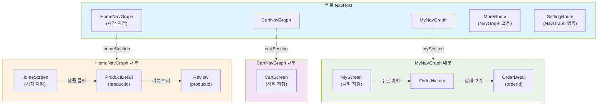
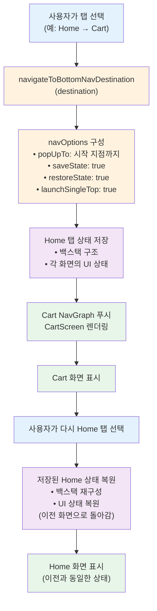
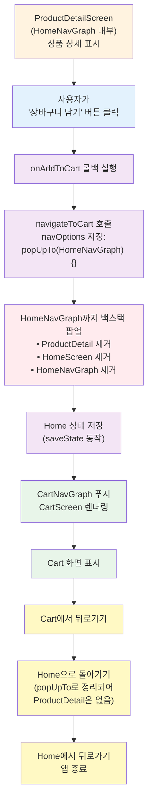

# Navigation Challenge - 멀티 탭 쇼핑앱 구현

이 challenge에서는 **Jetpack Compose Navigation** 을 활용하여 실제 앱 패턴에 가까운 멀티 탭 쇼핑앱을 구현했습니다.
복잡한 네비게이션 구조(탭, 중첩된 화면, 백 스택 관리)를 이해하고 패턴화하는 것이 목표입니다.

---

## 프로젝트 구조

```
challenge/
├── ShoppingApp.kt                          # 최상위 앱 Composable (Scaffold 기반 탭 구현)
├── ShoppingActivity.kt                     # DeepLink 전용 Activity (별도 진입점)
├── AppBarNavigator.kt                     # 앱 전역 상태 관리
│
├── navigation/                             # 공통 네비게이션 구성
│   ├── BottomNavDestination.kt             # BottomNav 열거형 (Home, Cart, My, More)
│   └── ShoppingBottomNavigationBar.kt      # BottomNav UI + 라우트 계층 판정 로직
│
├── home/                                   # Home 탭 네비게이션 그래프
│   ├── HomeScreen.kt                       # 상품 목록 화면
│   ├── ProductDetailScreen.kt              # 상품 상세 화면
│   ├── ReviewScreen.kt                     # 리뷰 화면
│   └── navigation/
│       ├── HomeRoute.kt                    # HomeNavGraph, HomeRoute sealed class
│       └── HomeNavigation.kt               # 라우트 정의 + 네비게이션 확장 함수
│
├── cart/                                   # Cart 탭 네비게이션 그래프
│   ├── CartScreen.kt                       # 장바구니 화면
│   └── navigation/
│       ├── CartRoute.kt                    # CartNavGraph, CartRoute
│       └── CartNavigation.kt               # 라우트 정의 + 네비게이션 확장 함수
│
├── my/                                     # My 탭 네비게이션 그래프
│   ├── MyScreen.kt                         # 마이페이지 (주문 목록)
│   ├── OrderHistoryScreen.kt               # 주문 이력 화면
│   ├── OrderDetailScreen.kt                # 주문 상세 화면
│   └── navigation/
│       ├── MyRoute.kt                      # MyNavGraph, MyRoute sealed class
│       └── MyNavigation.kt                 # 라우트 정의 + 네비게이션 확장 함수
│
├── setting/                                # Setting 화면
│   ├── SettingScreen.kt                    # 설정 화면
│   └── navigation/
│       ├── SettingRoute.kt                 # SettingRoute
│       └── SettingNavigation.kt            # 라우트 정의 + 네비게이션 확장 함수
│
└── more/                                   # More 탭 화면
    ├── MoreScreen.kt                       # More 화면 (비선택 가능한 탭)
    └── navigation/
        ├── MoreRoute.kt                    # MoreRoute
        └── MoreNavigation.kt               # 라우트 정의 + 네비게이션 확장 함수
```

---

## 전체 Navigation 구조

### 1. NavGraph 계층 구조



---

## 구현 내용 요약

### 1. 앱 진입점 및 상태 관리

#### ShoppingApp.kt
- **Scaffold 기반 탭 구현**: BottomBar가 숨겨졌다가 특정 라우트에서만 표시
- **두 가지 구현 방식**:
  - `ShoppingApp()`: Scaffold의 `bottomBar` 파라미터 사용 (innerPadding 미적용)
  - `ShoppingAppCustomBottomNav()`: Box 오버레이로 수동 배치 (navigationBarsPadding 적용)
- 각 화면에서 `bottomNavPadding` 또는 `BottomNavContentPadding` 을 통해 하단 padding 처리

#### AppBarNavigator.kt
- `currentDestination` property로 현재 백스택의 화면 추적
- `currentBackStackEntryAsState()` + 플래그 캐싱으로 null 깜빡임 해결
- 탭 전환 시 상태 저장/복원 (`navOptions { saveState = true; restoreState = true }`)

### 2. BottomNav 구조

#### BottomNavDestination.kt
- 4개 탭 정의: **Home, Cart, My, More**
- 각 탭마다:
  - `route`: 화면의 실제 Route 클래스
  - `baseRoute`: NavGraph 클래스 (라우트 계층 판정용)
  - `isSelectable`: More 탭은 `false` (탭으로 선택 불가)
  - `selectedIcon`, `unselectedIcon`: Material Icons

#### ShoppingBottomNavigationBar.kt
- `isRouteInHierarchy()` 확장함수로 현재 화면이 특정 탭에 속하는지 판정
- `NavDestination.hierarchy.any { it.hasRoute(route) }` 사용

### 3. 멀티 탭 구조 (baseRoute/NavGraph 패턴)

각 탭은 **NavGraph** 을 시작 지점으로 가지며, 내부에 여러 화면을 구성합니다.

#### Home 탭 (HomeNavGraph)
```
HomeNavGraph (시작 지점)
├── HomeScreen
├── ProductDetail (productId 파라미터)
└── Review (productId 파라미터)
```

**HomeRoute.kt**
```kotlin
@Serializable data object HomeNavGraph
sealed class HomeRoute {
    @Serializable data object HomeScreen : HomeRoute()
    @Serializable data class ProductDetail(val productId: Int) : HomeRoute()
    @Serializable data class Review(val productId: Int) : HomeRoute()
}
```

**HomeNavigation.kt**
- `homeSection(onProductClick, onReviewClick, onSettingClick, onAddToCart, onBack)`
- `navigation<HomeNavGraph>(startDestination = HomeRoute.HomeScreen::class) { ... }`로 그래프 정의
- 각 라우트별 `composable<>` 블록으로 UI 구성

#### Cart 탭 (CartNavGraph)
```
CartNavGraph
└── CartScreen
```

#### My 탭 (MyNavGraph)
```
MyNavGraph
├── MyScreen
├── OrderHistory
└── OrderDetail (orderId 파라미터)
```

#### More (단순 화면, NavGraph 없음)
```
MoreRoute
└── MoreScreen
```

### 탭 전환 시 상태 관리 흐름



### 4. 네비게이션 패턴

#### 라우트 확장 함수 (HomeNavigation.kt 예시)
```kotlin
fun NavController.navigateToHomeNavGraph(navOptions: NavOptions? = null)
fun NavController.navigateToHome(navOptions: NavOptions? = null)
fun NavController.navigateToProductDetail(productId: Int, navOptions: NavOptions? = null)
fun NavController.navigateToReview(productId: Int, navOptions: NavOptions? = null)
```

#### 탭 전환 (AppBarNavigator.kt)
```kotlin
fun navigateToBottomNavDestination(destination: BottomNavDestination) {
    val navOptions = navOptions {
        popUpTo(navController.graph.findStartDestination().id) { saveState = true }
        launchSingleTop = true
        restoreState = true
    }
    when (destination) {
        BottomNavDestination.Home -> navController.navigateToHomeNavGraph(navOptions)
        BottomNavDestination.Cart -> navController.navigateToCartNavGraph(navOptions)
        BottomNavDestination.My -> navController.navigateToMyNavGraph(navOptions)
        BottomNavDestination.More -> navController.navigateToMore()
    }
}
```

### 5. BackHandler 및 특수 케이스

#### Cart에서 뒤로가기
```kotlin
onBack = {
    appBarNavigator.navigateToBottomNavDestination(BottomNavDestination.Home)
}
```
- 단순 `navController.navigateUp()` 대신 Home 탭으로 전환

#### ProductDetail에서 AddToCart
```kotlin
onAddToCart = {
    navController.navigateToCart(navOptions = navOptions {
        popUpTo(HomeNavGraph) {}  // Home 그래프까지 팝업
    })
}
```
- 장바구니로 이동 + Home 스택 정리

### 장바구니 담기 흐름 (ProductDetail → Cart)



**핵심 포인트:**
- `popUpTo(HomeNavGraph)`: Home 그래프 전체를 백스택에서 제거
- ProductDetail → Cart로 이동 후, Cart에서 뒤로가면 Home 탭으로 돌아감
- ProductDetail로 다시 돌아오지 않음 (의도적인 백스택 정리)

---

### 6. BottomNav 표시/숨김

#### 기준
```kotlin
val shouldShowBottomNav = appBarNavigator.bottomNavDestinations.any { destination ->
    destination.isSelectable && currentDestination.isRouteInHierarchy(destination.baseRoute)
}
```

- **표시**: Home, Cart, My 탭의 모든 화면
- **숨김**: Setting, More, 기타 중첩 화면

---

## 파일별 역할 상세

### 최상위 레이어
| 파일 | 역할 |
|------|------|
| **ShoppingApp.kt** | Scaffold 구성, 탭 표시/숨김, NavHost 구성 |
| **AppBarNavigator.kt** | 현재 화면 추적, 탭 전환, 상태 보존/복원 |

### 공통 네비게이션
| 파일 | 역할 |
|------|------|
| **BottomNavDestination.kt** | 4개 탭 정의 (route, baseRoute, isSelectable, icons) |
| **ShoppingBottomNavigationBar.kt** | UI 렌더링, 라우트 계층 판정 |

### 각 탭의 구조 (Home 예시)
| 파일 | 역할 |
|------|------|
| **HomeRoute.kt** | HomeNavGraph (데이터 객체), HomeRoute sealed class 정의 |
| **HomeNavigation.kt** | NavGraph 구성, 라우트별 Composable 배치, 확장 함수 정의 |
| **HomeScreen.kt** | 상품 목록 렌더링 |
| **ProductDetailScreen.kt** | 상품 상세 렌더링 + 액션 콜백 |
| **ReviewScreen.kt** | 리뷰 렌더링 |

---

## 주요 패턴 및 학습 포인트

### 1. BaseRoute 패턴
```kotlin
val baseRoute: KClass<*> = route,  // 기본값: route와 동일
```
- Home 탭: `route = HomeRoute.HomeScreen::class`, `baseRoute = HomeNavGraph::class`
- 라우트 계층 구조 표현으로 탭 활성화 판정 단순화

### 2. NavGraph 시작 지점
```kotlin
navigation<HomeNavGraph>(startDestination = HomeRoute.HomeScreen::class) { ... }
```
- NavGraph 타입을 라우트로 사용하여 탭 전환 시 진입점 명확화
- 상태 저장/복원으로 화면 스택 유지

### 3. 현재 화면 추적 (null 깜빡임 해결)
```kotlin
val currentDestination: NavDestination?
    @Composable get() {
        val currentEntry by navController.currentBackStackEntryAsState()
        return currentEntry?.destination.also { destination ->
            if (destination != null) {
                previousDestination.value = destination
            }
        } ?: previousDestination.value
    }
```
- 탭 전환 중 null 상태를 이전 값으로 대체
- BottomNav 깜빡임 방지

### 4. 라우트 계층 판정
```kotlin
@Composable
fun NavDestination?.isRouteInHierarchy(route: KClass<*>): Boolean =
    this?.hierarchy?.any {
        it.hasRoute(route)
    } ?: false
```
- `hierarchy`: 현재 화면부터 최상위 그래프까지의 경로
- `hasRoute()`: 특정 라우트가 계층에 포함되는지 확인

### 5. 백 스택 관리
```kotlin
popUpTo(HomeNavGraph) {}  // HomeNavGraph까지 팝업
saveState = true         // 탭 상태 저장
restoreState = true      // 탭 재방문 시 상태 복원
launchSingleTop = true   // 중복 인스턴스 방지
```

---

## 사용 방법

### 앱 진입점 (Activity 또는 Preview)
```kotlin
val appBarNavigator = rememberAppBarNavigator()
ShoppingApp(appBarNavigator = appBarNavigator)
// 또는
ShoppingAppCustomBottomNav(appBarNavigator = appBarNavigator)
```

### 화면 간 네비게이션
```kotlin
// Home 탭 내에서 상품 상세로 이동
navController.navigateToProductDetail(productId = 1)

// Home 탭 내에서 리뷰로 이동
navController.navigateToReview(productId = 1)

// 상품 상세에서 장바구니로 이동 (Home 스택 정리)
navController.navigateToCart(navOptions = navOptions {
    popUpTo(HomeNavGraph) {}
})

// 설정 화면으로 이동
navController.navigateToSetting()
```

### 탭 전환
```kotlin
appBarNavigator.navigateToBottomNavDestination(BottomNavDestination.Cart)
```

---

## 주요 학습 성과

1. **멀티 탭 구조의 라우트 설계**: baseRoute를 통한 계층 관계 표현
2. **백 스택 상태 관리**: saveState/restoreState로 화면 스택 유지
3. **현재 화면 추적**: null 깜빡임 해결로 안정적인 UI 상태 관리
4. **라우트 계층 판정**: hierarchy를 활용한 탭 활성화 로직
5. **BackHandler 및 특수 네비게이션**: 탭 이동 시 백스택 정리 패턴
6. **Sealed Class + Serialization**: 타입 안전한 라우트 정의

---

### 7. DeepLink

#### navDeepLink 등록 (HomeNavigation.kt)
```kotlin
composable<HomeRoute.ProductDetail>(
    deepLinks = listOf(
        navDeepLink<HomeRoute.ProductDetail>(
            basePath = "https://study.example.com/product",
        ),
    ),
) { ... }
```

#### ShoppingActivity (별도 진입점)
ShoppingApp이 StudyNavHost 안에 중첩되어 있어, 외부 NavHost가 DeepLink Intent를 가로챈다.
이를 해결하기 위해 **별도 Activity**로 분리:

```kotlin
class ShoppingActivity : ComponentActivity() {
    override fun onCreate(savedInstanceState: Bundle?) {
        super.onCreate(savedInstanceState)
        setContent {
            MaterialTheme {
                ShoppingApp(appBarNavigator = rememberAppBarNavigator())
            }
        }
    }
}
```

AndroidManifest에 intent-filter 등록:
```xml
<activity android:name=".study.sample.navigation.challenge.ShoppingActivity"
    android:exported="true">
    <intent-filter>
        <action android:name="android.intent.action.VIEW" />
        <category android:name="android.intent.category.DEFAULT" />
        <category android:name="android.intent.category.BROWSABLE" />
        <data android:scheme="https"
            android:host="study.example.com"
            android:pathPrefix="/product" />
    </intent-filter>
</activity>
```

**원칙: NavHost가 이중 중첩되면 DeepLink용 별도 Activity를 만든다.**

### 8. 테스트 (ShoppingNavigationTest)

Robolectric + Compose UI Test로 7개 통합 테스트 작성:

| # | 테스트 | 검증 내용 |
|---|--------|----------|
| 1 | 기본 탭 전환 | Home → Cart → My 전환 |
| 2 | popUpTo 동작 | 장바구니 담기 시 ProductDetail 백스택 제거 |
| 3 | 탭 내부 스택 보존 | Home → Detail → Cart → Home 복귀 시 Detail 유지 |
| 4 | navigateUp 동작 | 하위 화면에서 이전 화면 복귀 |
| 5 | DeepLink 진입 | handleDeepLink()로 ProductDetail 직접 진입 |
| 6 | Setting 전체화면 | Setting 진입 시 BottomBar 숨김 |
| 7 | Setting 뒤로가기 | 이전 탭 + BottomBar 복귀 |

---

## 관련 문서

- **CHALLENGE.md**: 원본 요구사항 문서
- **STUDY_NOTE.md**: 학습 노트 (currentDestination, hierarchy, baseRoute 등)
- **STUDY_BACKLOG.md**: 전체 학습 진행 현황
